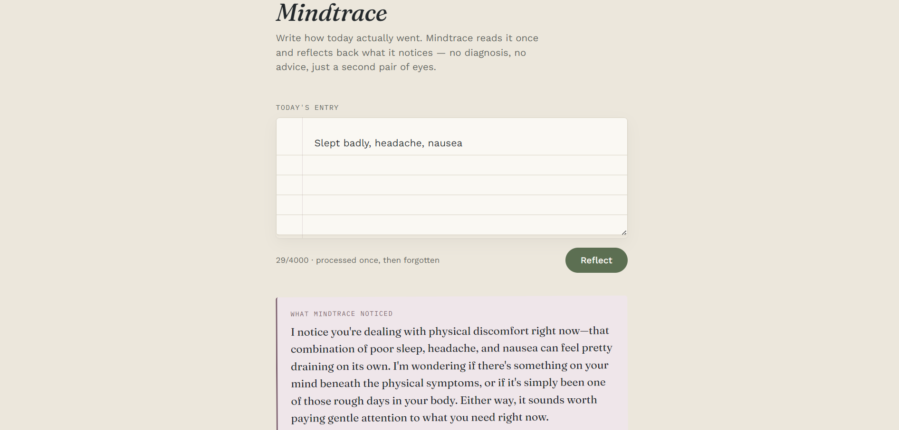

# Mindtrace
**Stack:** Next.js (App Router) · Claude API (Haiku) · Vercel
   

A private mental health journal. Write an entry, Claude reflects on it once,
nothing is saved. This is the week-1 build: stateless, no login, no database.

## What's in this build

- One page: a textarea + a "Reflect" button
- One API route (`/api/insight`) that sends your entry to Claude (Haiku, to
  keep costs low) and returns a short, careful reflection
- Nothing is stored anywhere — each entry is used for one API call and then
  discarded. Storage with consent is a later milestone.
- If an entry contains crisis language, the reflection is replaced with a
  gentle nudge toward the 988 Suicide & Crisis Lifeline (US) instead of an
  observation.

## Run it locally

You'll need Node.js installed (get it at [nodejs.org](https://nodejs.org),
the LTS version).

1. **Install dependencies**

   ```
   npm install
   ```

2. **Add your API key**

   Copy `.env.local.example` to a new file called `.env.local`, then paste
   in your real key from [console.anthropic.com](https://console.anthropic.com)
   (Settings → API Keys):

   ```
   ANTHROPIC_API_KEY=sk-ant-your-real-key-here
   ```

   `.env.local` is already in `.gitignore` — it will never get committed or
   pushed to GitHub.

3. **Start the dev server**

   ```
   npm run dev
   ```

   Open [http://localhost:3000](http://localhost:3000) and try it.

## Deploy to Vercel

1. Push this folder to a new GitHub repository.
2. Go to [vercel.com](https://vercel.com), sign in with GitHub, and click
   **Add New → Project**. Pick this repo.
3. Vercel will detect it's a Next.js app automatically — you don't need to
   change any build settings.
4. Before deploying, add your environment variable: in the project's
   **Settings → Environment Variables**, add
   `ANTHROPIC_API_KEY` with your real key as the value.
5. Click **Deploy**. You'll get a live `.vercel.app` link anyone can open.

That live link is what you'll submit for "Ship it."

## Costs

This uses Claude Haiku, the cheapest current model, and each reflection is
capped at 300 tokens, so testing costs a small fraction of a cent per entry.
You do need a payment method on your Anthropic Console account — there's a
small free trial credit for new accounts, but no ongoing free tier for API
use (the free Claude.ai chat app is separate from this).

## Known limitations

- **Crisis detection is single-layer.** Whether an entry gets a reflection
  or a 988 redirect is decided by one Claude call in one pass, with no
  independent check behind it. It hasn't been adversarially tested against
  ambiguous or indirect crisis language.
- **No rate limiting.** The `/api/insight` route has no request throttling,
  so it's currently possible to hammer the endpoint and run up API costs.

## Where to go next (weeks 2+)

- **Week 2:** let someone ask a one-off follow-up question about their
  reflection (send the entry + reflection + question back to Claude).
- **Weeks 3–4:** add the consent toggle. When on, store the entry
  (encrypted) tied to a logged-in user instead of discarding it.
- **Weeks 5–6:** once there's a history of entries, add real pattern-finding
  across them, and — only if the person has separately opted in — turn
  observations into recommendations.

## Project structure

```
app/
  layout.js          root layout, fonts, page metadata
  page.js             the journal UI
  globals.css         design tokens + styling
  api/insight/route.js   calls Claude, returns a reflection
```
